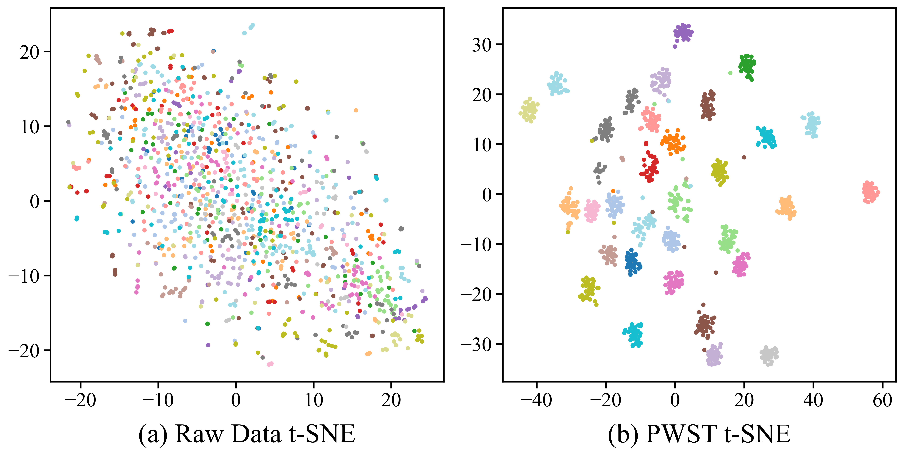

# WST-CAA: A BrainPrint Recognition Framework Based on Wavelet Scattering Transform and Channel-Axial Attention Dense Network


This repository is the official implementation of the paper "WST-CAA: A BrainPrint Recognition Framework Based on Wavelet Scattering Transform and Channel-Axial Attention Dense Network"

## Datasets

**FACED**: The FACED dataset was co-created by the Tsinghua Laboratory of Brain and Intelligence and the State Key Laboratory of Intelligent Technologies and Systems at Tsinghua University. It comprises 32-channel EEG recordings from 123 participants, making it one of the largest publicly available affective-computing EEG datasets to date. The dataset aims to support the development of robust, cross-subject affective computing algorithms by offering fine-grained emotion annotations across nine discrete categories (amusement, inspiration, joy, tenderness, anger, fear, disgust, sadness, and neutral) elicited via video stimuli. All data and accompanying documentation are freely accessible through the Synapse platform: [FACED](https://www.synapse.org/Synapse:syn50614194/wiki/620378).

**DEAP**: DEAP is a widely used multimodal benchmark for human emotion analysis, featuring synchronized EEG and peripheral physiological recordings from 32 healthy volunteers as they watched 40 one-minute excerpts of music videos. Each participant’s responses were self-rated on arousal, valence, like/dislike, dominance, and familiarity dimensions, and for 22 of the 32 subjects, frontal face video was also captured. To access the dataset, users must submit a usage application via the official website:[DEAP](https://eecs.qmul.ac.uk/mmv/datasets/deap/download.html).

## How To Use

### Clone

Clone this GitHub repository:

```
git clone https://github.com/jhuangscnu/BrainPrint_WST-CAA.git
cd WST-CAA
```

> [!NOTE]
>
>  All the following commands and paths are assumed to be executed **from the project root directory** (`WST-CAA/`).

### Dependencies

Before running the project, please make sure you have **Conda** installed.

```
cd envs
conda env create -f environment.yml -n WSTCAA
conda activate WSTCAA
```

### Preprocessing

You need to place the downloaded dataset in the corresponding directory(FACED: WST_CAA/Dataset/FACEDDatase; DEAP:WST_CAA/Dataset/DEAPDatase)

For the FACED dataset, please ensure that the **Data** folder and the **recording_info.csv** file are placed in **WST_CAA/Dataset/DEAPDataset**

```
cd Preprocessing/FACED
python main.py
```


for DEAP, please make sure that the **DEAP_Raw** folder and the **participant_ratings.xls** file are placed in **WST_CAA/Dataset/DEAPDataset**

```
cd Preprocessing/DEAP
python main.py
```

The preprocessed files are stored in the **ProcessedData**

### Wavelet Scattering Transform

for FACED:

```
cd WaveletScattering
python WaveletScatteringFACED.py
```

for DEAP:

```
cd WaveletScattering
python WaveletScatteringDEAP.py
```

The immediate features are stored in the **AfterWST**

## Trainning

for FACED:

```
cd Train
python  trainFACED.py
```

The trained model and log files are stored in the FACEDOutput folder.

for DEAP

```
cd Train
python  train.py
```

The trained model and log files are stored in the DEAPOutput folder.

All results include the complete model and  models with ablation study

## Baseline

for CADCNN

```
cd Baseline
python train.py
```

for CNN_GRU

```
cd Baseline
python trainCNN_GRU.py
```

The results include two datasets


## Result

Finally, use 'eval.sh' to generate 'Result.csv' and 't-sne.py' to generate 'DEAP_tSNE_compare.png'

```
cd eval
sh eval.sh
python t-sne.py
```



